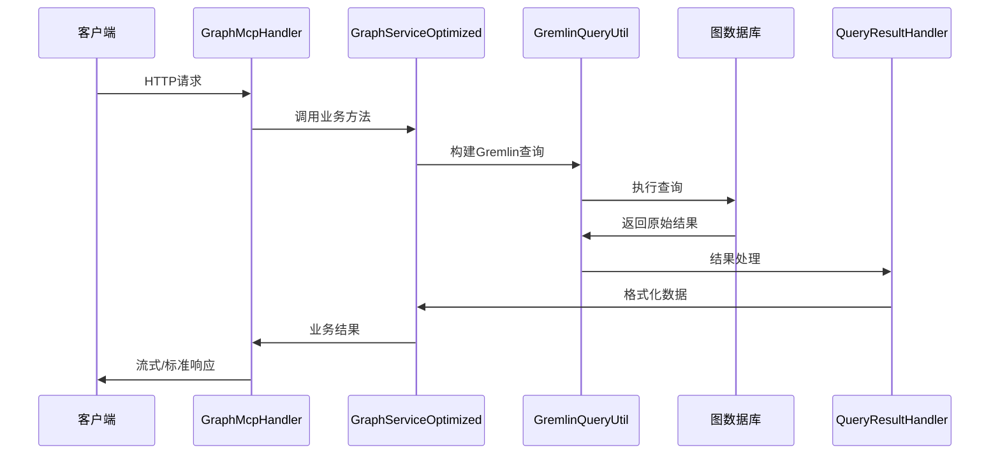
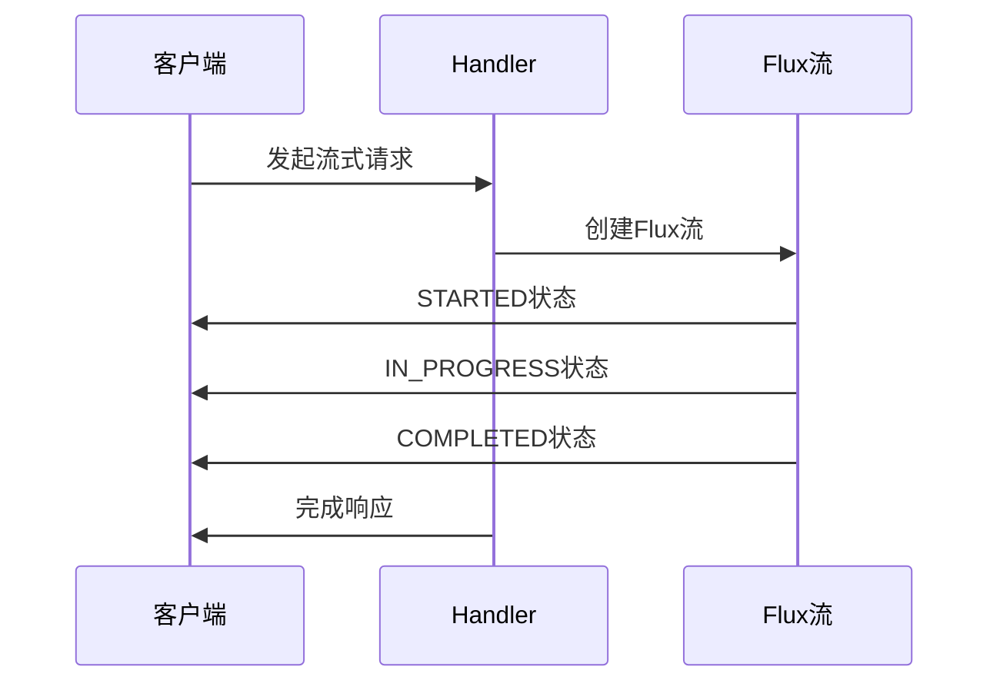

# MCP算法系统架构设计

## 1. 系统概述

本项目是一个基于Spring Boot和Spring AI的知识图谱算法服务，采用MCP (Model Context Protocol) 架构，提供图数据查询和算法计算功能。系统主要服务于明星关系网络分析，支持关系链查询、共同好友发现、相似度计算等多种图算法。

### 1.1 技术栈
- **核心框架**: Spring Boot 3.4.5
- **响应式编程**: Spring WebFlux
- **AI集成**: Spring AI 1.0.0 (MCP Server/Client)
- **开发语言**: Java 17
- **图查询语言**: Gremlin
- **数据序列化**: Jackson, FastJSON2
- **构建工具**: Maven

## 2. 系统逻辑设计

### 2.1 整体架构
系统采用分层架构设计，从上到下包括：
- **表示层**: MCP Handler (RESTful API)
- **业务逻辑层**: Graph Service (算法服务)
- **数据访问层**: Gremlin Query Util (图数据库访问)
- **核心算法层**: Graph Algorithms (图算法实现)
- **数据模型层**: Graph Core (节点、边、图结构)

### 2.2 设计模式
- **MVC模式**: 控制器-服务-数据访问分离
- **工具函数模式**: 基于Spring AI的Tool Function架构
- **反应式编程**: 使用Flux进行流式数据处理
- **模板方法模式**: Gremlin查询模板化
- **策略模式**: 多种图算法策略实现

### 2.3 核心流程
```
用户请求 → MCP Handler → Graph Service → Gremlin Query → 外部图数据库 → 结果处理 → 流式响应
```

## 3. 核心组件设计

### 3.1 图数据结构层 (com.example.graph.core)

#### 3.1.1 Node (节点)
```java
public class Node {
    private final String id;
    private Map<String, Object> attributes;
}
```
- **职责**: 表示图中的节点实体
- **特性**: 不可变ID，可扩展属性映射
- **用途**: 明星、作品等实体建模

#### 3.1.2 Edge (边)
```java
public class Edge {
    private final Node source;
    private final Node destination; 
    private final double weight;
}
```
- **职责**: 表示节点间的关系
- **特性**: 支持权重，有向/无向可配置
- **用途**: 好友关系、合作关系等建模

#### 3.1.3 Graph (图)
```java
public class Graph {
    private final Map<Node, List<Edge>> adjacencyList;
    private final boolean directed;
    private final boolean weighted;
}
```
- **职责**: 图数据结构的核心容器
- **特性**: 邻接表实现，支持有向/无向、加权/非加权
- **功能**: 节点/边管理、子图创建、图遍历

### 3.2 算法组件层 (com.example.graph.algorithm)

#### 3.2.1 PageRank算法
- **功能**: 计算节点重要性评分
- **优化**: 出度缓存、数值稳定性优化、悬挂节点处理
- **应用**: 明星影响力排名

#### 3.2.2 JaccardSimilarity算法  
- **功能**: 基于共同邻居的相似度计算
- **应用**: 明星相似度分析

#### 3.2.3 ShortestPath算法
- **功能**: 最短路径查找
- **应用**: 关系链路径发现

#### 3.2.4 CommunityDetection算法
- **功能**: 社区发现
- **应用**: 明星圈子分析

### 3.3 MCP服务层 (com.example.graph.mcp)

#### 3.3.1 GraphMcpHandler (控制器)
```java
@RestController
@RequestMapping("/mcp")
public class GraphMcpHandler {
    // 5个核心API端点
    // 流式响应支持
    // 异常处理
}
```
- **职责**: 处理HTTP请求，提供RESTful API
- **特性**: 支持流式响应(NDJSON)、标准JSON响应
- **端点**: 
  - `/relation_chain_between_stars` - 关系链查询
  - `/mutual_friend_between_stars` - 共同好友
  - `/dream_team_common_works` - 共同作品
  - `/similarity_between_stars` - 相似度计算
  - `/most_recent_common_ancestor` - 共同祖先

#### 3.3.2 GraphServiceOptimized (业务服务)
```java
@Service
public class GraphServiceOptimized {
    @Tool(name = "relation_chain_between_stars")
    public String relationChain(String sourceName, String targetName);
    // 其他Tool函数...
}
```
- **职责**: 核心业务逻辑实现，Spring AI Tool集成
- **特性**: 注解驱动的Tool函数、参数验证、结果优化
- **功能**: 5大核心查询功能实现

#### 3.3.3 GraphQueryAgent (查询代理)
```java
@Component  
public class GraphQueryAgent {
    // 意图识别
    // 查询路由
    // 结果封装
}
```
- **职责**: 自然语言查询理解和路由
- **特性**: 正则模式匹配、意图分类、实体提取

### 3.4 工具组件层 (com.example.graph.mcp.util)

#### 3.4.1 GremlinQueryUtil
- **职责**: Gremlin查询执行和参数替换
- **特性**: 模板化查询、参数验证、HTTP客户端封装

#### 3.4.2 QueryResultHandler  
- **职责**: 查询结果处理和转换
- **特性**: JSON解析、数据提取、结果截断

#### 3.4.3 JsonExtractor
- **职责**: 复杂JSON结构解析
- **特性**: 嵌套数据提取、格式标准化

### 3.5 配置组件层 (com.example.graph.mcp.config)

#### 3.5.1 MCPConfig
```java
@Configuration
public class MCPConfig {
    @Bean
    public ToolCallbackProvider taskTools(GraphServiceOptimized graphService);
}
```
- **职责**: Spring AI MCP配置
- **特性**: Tool函数注册、回调配置

#### 3.5.2 GraphApiConfig
- **职责**: 图数据库连接配置
- **特性**: 外部API地址配置

#### 3.5.3 WebFluxConfig
- **职责**: 响应式Web配置
- **特性**: 异步处理、流式响应配置

## 4. 数据流转设计

### 4.1 请求处理流程



### 4.2 流式响应流程



### 4.3 数据转换层次

1. **原始数据层**: Gremlin查询返回的JSON
2. **解析数据层**: JsonExtractor提取的结构化数据
3. **业务数据层**: 业务逻辑处理后的数据
4. **响应数据层**: 最终API响应格式

### 4.4 缓存策略

- **查询模板缓存**: 预编译的Gremlin查询模板
- **算法结果缓存**: PageRank等算法的计算结果
- **连接池缓存**: HTTP连接复用

## 5. 接口设计

### 5.1 RESTful API设计

#### 5.1.1 关系链查询
```http
POST /mcp/relation_chain_between_stars
Content-Type: application/json
Accept: application/x-ndjson

{
    "sourceName": "周星驰",
    "targetName": "吴孟达"
}
```

**响应格式** (流式NDJSON):
```json
{"status":"STARTED","progress":0,"message":"开始查询关系链"}
{"status":"COMPLETED","progress":100,"data":"查询结果JSON"}
```

#### 5.1.2 共同好友查询  
```http
POST /mcp/mutual_friend_between_stars
Content-Type: application/json

{
    "names": ["周星驰", "吴孟达"]
}
```

#### 5.1.3 共同联系人查询
```http
POST /mcp/dream_team_common_works
Content-Type: application/json

{
    "names": ["周星驰", "吴孟达"]
}
```

#### 5.1.4 相似度查询
```http  
POST /mcp/similarity_between_stars
Content-Type: application/json

{
    "names": ["周星驰", "吴孟达"],
    "relationshipType": "合作"
}
```

#### 5.1.5 共同祖先查询
```http
POST /mcp/most_recent_common_ancestor  
Content-Type: application/json

{
    "names": ["周星驰", "吴孟达"],
    "maxDepth": 3
}
```

### 5.2 Spring AI Tool接口设计

每个业务方法都注册为Spring AI Tool函数：

```java
@Tool(name = "relation_chain_between_stars", 
      description = "查询两个明星之间的好友关系链")
public String relationChain(
    @ToolParam(description = "人名1") String sourceName,
    @ToolParam(description = "人名2") String targetName
) throws IOException;
```

### 5.3 响应格式标准

#### 5.3.1 流式响应 (StreamableResponse)
```java
{
    "status": "STARTED|IN_PROGRESS|COMPLETED|ERROR",
    "progress": 0-100,
    "data": "实际数据", 
    "error": "错误信息",
    "message": "状态描述"
}
```

#### 5.3.2 标准响应
```java
{
    "status": "COMPLETED|ERROR",
    "progress": 100,
    "data": "查询结果",
    "error": null,
    "message": "操作描述"
}
```

### 5.4 错误处理设计

- **参数验证错误**: 400 Bad Request
- **业务逻辑错误**: 返回错误状态的响应体
- **系统异常**: 500 Internal Server Error
- **超时错误**: 请求超时处理

## 6. 部署架构

### 6.1 应用配置
```yaml
spring:
  ai:
    mcp:
      server:
        name: knowledge-graph-algorithrm-service
        type: ASYNC
        enabled: true
        request-timeout: 60000
        max-connections: 100
```

